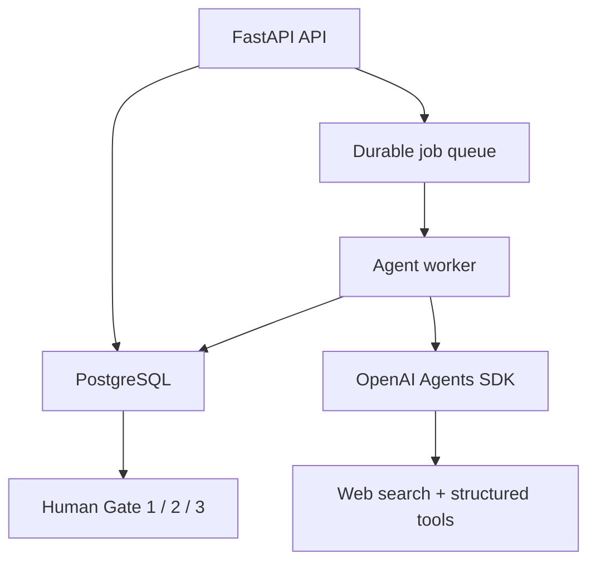

# Architecture

CaseFlow v1 separates the public API, durable workflow state, background execution,
LLM runtime, and human approvals.

## Boundaries

- **API:** validates PDF uploads, authentication, and workflow requests.
- **Database:** source text, artifacts, jobs, version locks, and immutable audit events.
- **Worker:** claims jobs with row locking and runs one workflow stage at a time.
- **Agent runtime:** typed specialist agents using structured Pydantic outputs.
- **Service:** deterministic state machine; models cannot skip human gates.
- **v0.1:** preserved permanently on the `v0.1` branch.

## State flow

`created → framing → gate 1 → research → strategy → gate 2 → build → defense → gate 3 → completed`

Failure states retain an error and audit event. A rejected gate returns the case to the
last human-editable stage.
